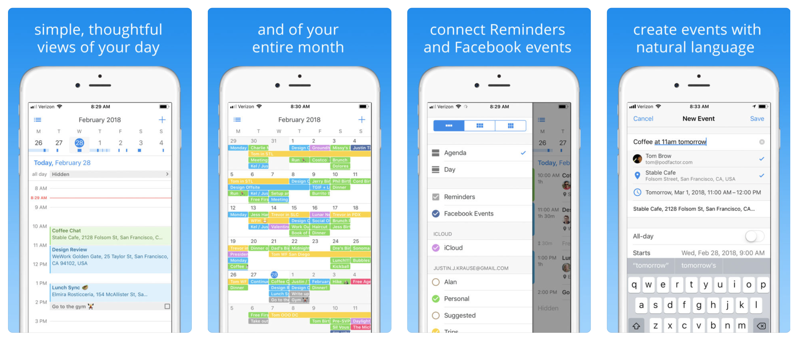

Pod was a popular iOS calendar app for iOS that I built with [Justin Krause](https://justinkrause.biz) from 2016–2018.

In 2019 it was acquired and rebranded as [Calendar](https://itunes.apple.com/us/app/calendar/id1113106806?mt=8).

Pod was used by 20 thousand people each month and was featured 5+ times on the App Store.

We raised $1M in funding from [Harrison Metal](https://www.harrisonmetal.com) and launched features that are unique among calendars:
* Lists for sharing relationships with a team and managing a pipeline
* See your entire history of meetings and emails with a person
* Collaborative scheduling without back-and-forth using polls
* Natural language entry for event time, people, and place

The app was praised most for its clean, simple design and powerful views of time.
